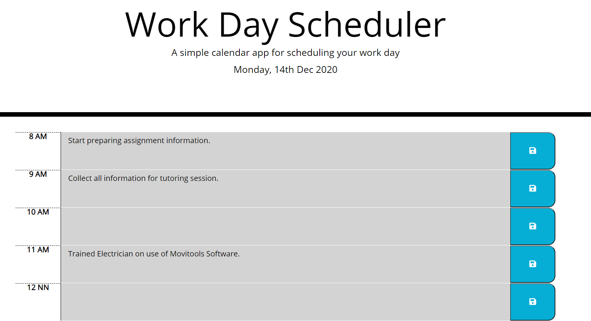

# Work-Day-Scheduler
The application saved in this repo mimic a calendar application that allows a user to save scheduled activities for the day.

## Notes:
When the planner is opened, the current date is displayed using the moment.js format of "dddd, Do MMM YYYY" i.e. Monday, 14th Dec 2020.

The timeblocks presented starts at 8AM and ends at 7PM. (line 51 in code).

Depending on what time you opened the planner, the time blocks are color coded to indicate whether they are in the past, present, or future.

A textarea element will allow the user to enter event on any time block chosen. When the save button for a given time block is clicked, the event for that particular time block is saved in the local storage. When the page is refreshed, those information will be copied back to the respective time blocks. 

To make it unique, I assigned a local storage key in the following format : "hourOfDay" + "dayOfYear. I did this so that events entered won't appear on the same timeblock on other days. Moving forward a more systematic approach in storing data could be implemented.

## Event Listener

Button click and Text change event listeners (lines 109 and 113).

## The application could be accessed using the following link:
https://apolinar291076.github.io/Work-Day-Scheduler/

## The repo for the application could be accessed using the following link:
 https://github.com/Apolinar291076/Work-Day-Scheduler.git
 

## Screenshot

